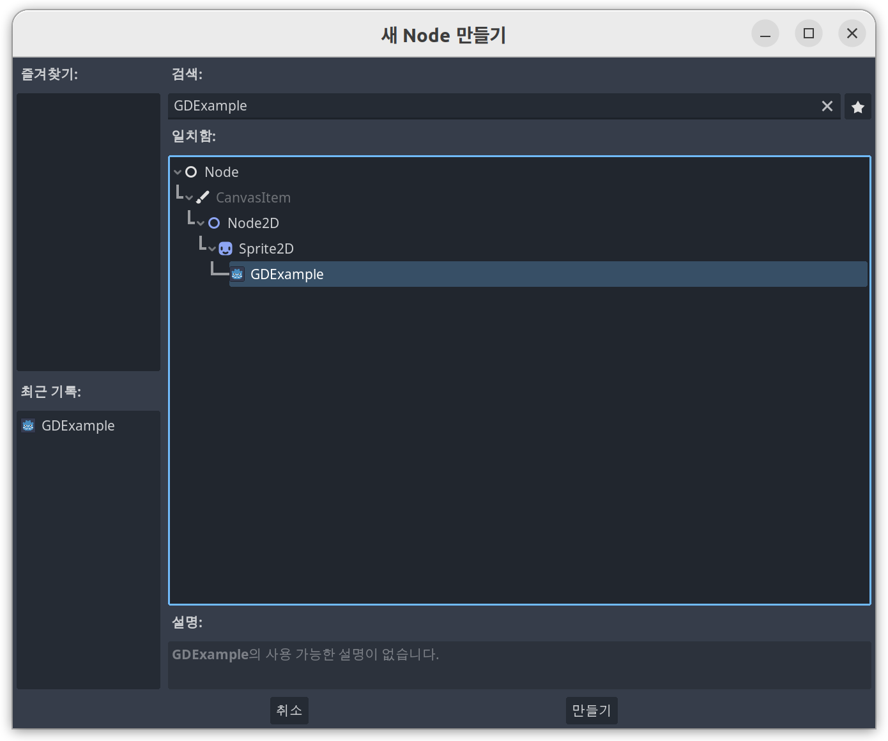
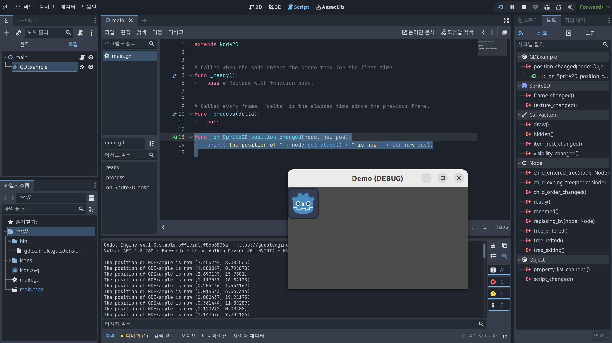

# C++ Demo

- docs: [GDExtension](/docs/gdextension.md)
- godot
  - docs: [GDExtension C++ example](https://docs.godotengine.org/en/stable/tutorials/scripting/gdextension/gdextension_cpp_example.html)
  - github: [godot-cpp](https://github.com/godotengine/godot-cpp)

## Start

Install SCons:

```bash
sudo apt install scons
```

Create directories:

```bash
mkdir demo src
```

Add lines to .gitignore:

```bash
echo 'godot-cpp' >> .gitignore
echo '.clangd' >> .gitignore
echo 'compile_commands.json' >> .gitignore
```

Clone the repo:

```bash
git clone -b 4.1 https://github.com/godotengine/godot-cpp
cd godot-cpp
```

Create a result file:

```bash
godot --dump-extension-api
```

Run SCons with Clang:

```bash
bear -- scons platform=linux -j12 custom_api_file=../extension_api.json use_llvm=yes
```

a static library:

```bash
cpp_demo/godot-cpp/bin/
└── libgodot-cpp.linux.template_debug.x86_64.a
```

Run SCons with Clang:

```bash
bear -- scons platform=linux -j12 custom_api_file=./extension_api.json use_llvm=yes
# or g++
scons platform=linux -j12 custom_api_file=./extension_api.json
```

## Compile the plugin

### Create a Godot Project

in demo, create a project and `main.tscn`

```bash
cpp_demo/
├── .clangd
├── .gitignore
├── README.md
├── SConstruct
├── demo/
│   ├── .gitattributes
│   ├── .gitignore
│   ├── .godot/
│   ├── icon.svg
│   ├── icon.svg.import
│   ├── main.tscn
│   └── project.godot
├── godot-cpp/
└── src/
```

### Plugin files

```bash
cpp_demo/
├── .clangd
├── .gitignore
├── README.md
├── SConstruct
├── demo/
│   ├── .gitattributes
│   ├── .gitignore
│   ├── .godot/
│   ├── icon.svg
│   ├── icon.svg.import
│   ├── main.tscn
│   └── project.godot
├── godot-cpp/
└── src/
    ├── gdexample.cpp
    ├── gdexample.h
    ├── register_types.cpp
    └── register_types.h
```

### Download a SConstruct file

```bash
cpp_demo/
├── README.md
├── icon.svg
├── SConstruct
├── project.godot
├── demo/
│   ├── .gitattributes
│   ├── .gitignore
│   ├── .godot/
│   ├── icon.svg
│   ├── icon.svg.import
│   ├── main.tscn
│   └── project.godot
├── godot-cpp/
└── src/
    ├── gdexample.cpp
    ├── gdexample.h
    ├── register_types.cpp
    └── register_types.h
```

### Compile with SCons

```bash
bear -- scons platform=linux -j12 use_llvm=yes
# or g++
scons platform=linux -j12
```

### Results

```bash
cpp_demo/
├── .clangd
├── .gitignore
├── .sconsign.dblite
├── README.md
├── SConstruct
├── compile_commands.json
├── demo/
│   ├── .gitattributes
│   ├── .gitignore
│   ├── .godot/
│   ├── icon.svg
│   ├── icon.svg.import
│   ├── main.tscn
│   ├── project.godot
│   └── bin/
│       ├── gdexample.gdextension
│       └── libgdexample.linux.template_debug.x86_64.so
├── godot-cpp/
└── src/
    ├── gdexample.cpp
    ├── gdexample.h
    ├── gdexample.os
    ├── register_types.cpp
    ├── register_types.h
    └── register_types.os
```

### Create a gdextension file

- [demo/bin/gdexample.gdextension](demo/bin/gdexample.gdextension)

## GDExample Node

- [src/gdexample.cpp](src/gdexample.cpp)
- [src/gdexample.h](src/gdexample.h)
- [src/register_types.cpp](src/register_types.cpp)
- [src/register_types.h](src/register_types.h)

### Add a Node

a newly available GDExample Node to the main scene.



### Signal

Connect a signal and Run:



